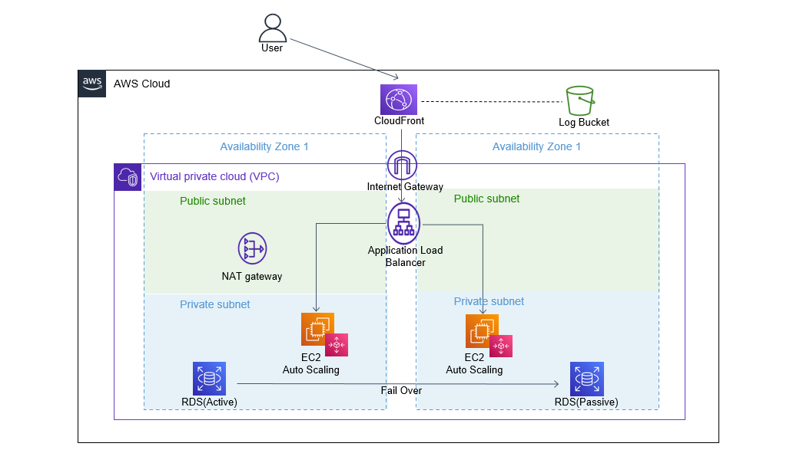

# CloudFormation

### 【構成図】
※「template-private.txt」を使用して、EC2をプライベートサブネットに展開した場合の構成図。

### 【工夫点】
#### ・EC2を展開するサブネットを選べるように、２種類のテンプレートを作成。
　EC2をプライベートサブネットへ展開することで、EC2を外部アクセスから遮断できると考えたが、NatGateWayの料金が膨らむことから、EC2をパブリックサブネットに展開するテンプレート(template-public.txt)を作成。  
#### ・セキュリティグループを使用したアクセス制限。
　各AWSリソースへのアクセス許可設定は以下です。  
　ALB: Cloudfront, EC2  
　EC2: ALB, RDS  
　RDS: EC2  
#### ・ALBログを収集し、クライアントIPアドレスをS3へ記録。  
#### ・ALBへのアクセスをCloudFrontからのみに設定。マネージドプレフィックスを使用。  
#### ・RDSパスワードやRDSユーザー名を「Secret Manager」を使用して、動的参照。